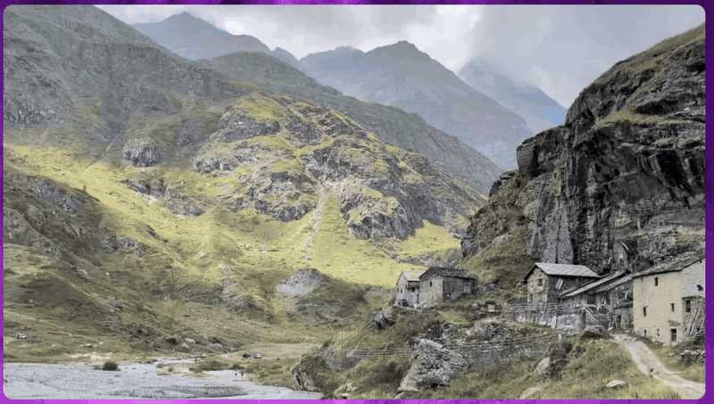

# Carosello

A fast, minimalist image and video viewer for Linux.

Built with **Rust** and **GTK4/libadwaita** for native Wayland/X11 support.



## Features

- Opens images and videos from the command line, a file chooser, or drag and drop
- Browses the current directory's supported media in natural filename order
- Navigates with the keyboard, arrow keys, or trackpad gestures
- Shows a slide transition between items when the next frame is ready
- Decodes images on worker threads and prefetches neighboring images
- Fits media to the window with aspect-ratio preservation
- Zooms with the keyboard, `Ctrl` + mouse wheel, pinch, or double-click
- Anchors double-click zoom at the pointer and lets you pan while zoomed
- Applies EXIF orientation when displaying images
- Rotates left/right and mirrors images horizontally
- Plays videos with play/pause, seek, volume, mute, elapsed time, and duration controls
- Starts videos muted, plays them automatically, and loops playback
- Moves the current item to Trash, with direct deletion when no Trash is available
- Offers persistent slide-animation and two-finger-swipe preferences
- Auto-hides the header and video controls for distraction-free viewing
- Shows in-app messages for load, save, Trash, and video errors
- Supports fullscreen mode

## Supported Formats

| Type | Formats |
|------|---------|
| Images | JPEG (`.jpg`, `.jpeg`), PNG, WebP, GIF, BMP, TIFF (`.tif`, `.tiff`) |
| Video | MP4, WebM, Matroska (`.mkv`) |

Supported media is recognized case-insensitively by extension. Actual image
decoding is based on the file contents, while video playback depends on the
codecs provided by the installed GStreamer plugins.

## Installation

### Arch Linux (build from source)

Carosello is not available through the AUR, so install it by building the
upstream source locally. A per-user Meson install is recommended because it
does not overwrite files managed by Pacman and does not require `sudo` for the
install step.

Install the build and runtime dependencies:

```bash
sudo pacman -S --needed \
  base-devel git meson rust gtk4 libadwaita \
  hicolor-icon-theme desktop-file-utils
```

For broad video-codec support, also install GStreamer's common plugin sets:

```bash
sudo pacman -S --needed \
  gstreamer gst-plugins-good gst-plugins-bad \
  gst-plugins-ugly gst-libav
```

Clone, build, and install under `~/.local`:

```bash
git clone https://github.com/grigio/carosello.git
cd carosello
meson setup builddir --prefix="$HOME/.local"
meson compile -C builddir
meson install -C builddir
```

Make sure `~/.local/bin` is in your `PATH`, then launch Carosello from the
application menu or run:

```bash
carosello
```

The Meson install places the binary, desktop entry, AppStream metadata, and
icon under `~/.local`. To rebuild after pulling new changes, run:

```bash
meson compile -C builddir
meson install -C builddir
```

### Flatpak artifact

Download the latest `.flatpak` file from
[GitHub Releases](https://github.com/grigio/carosello/releases) and install it:

```bash
flatpak install --user ./carosello.flatpak
flatpak run io.github.grigio.carosello
```

The release artifact produced by CI is currently for x86_64.

### Flatpak from this source tree

The manifest targets the GNOME 50 runtime and its freedesktop 25.08 Rust
extension:

```bash
sudo pacman -S --needed flatpak flatpak-builder
flatpak install --user flathub \
  org.gnome.Platform//50 org.gnome.Sdk//50 \
  org.freedesktop.Sdk.Extension.rust-stable//25.08
```

The manifest also expects the ignored `cargo-sources.json` file. Generate it
from `Cargo.lock` using the `Generate Cargo sources for Flatpak` command in
[`.github/workflows/ci.yml`](.github/workflows/ci.yml), then build and install:

```bash
flatpak-builder --user --install --force-clean \
  build-dir io.github.grigio.carosello.yml
```

The Flatpak has read/write host and GVfs access so it can browse remote
folders, edit images in place, and use Trash where supported. A single file
opened through the document portal contains only that file; use **Open Folder…**
to export a directory and browse its siblings.

### Cargo development build

To compile without installing desktop integration:

```bash
cargo build --release
./target/release/carosello
```

## Usage

```bash
# View supported media in the current directory
carosello

# View supported media in a specific directory
carosello /path/to/directory

# View a specific local file and its supported siblings
carosello /path/to/image.jpg
```

Directory listings are shallow rather than recursive and include supported
media files only. Filenames are naturally sorted, so names such as `IMG2.jpg`
come before `IMG10.jpg`. Carosello uses one positional path; launching it
again while a window is open presents the existing window.

Use **Open…** (`Ctrl+O`) to choose a file or **Open Folder…** (`Ctrl+Shift+O`)
to choose a directory. With the Flatpak document portal, choosing a folder is
also the reliable way to browse siblings and obtain a writable export.

## Image Editing

The header buttons rotate the current image left or right and mirror it
horizontally. Each operation is saved in place over the original file, and the
view refreshes after saving. JPEG EXIF orientation is normalized to prevent a
reload from rotating the image a second time.

Image edits are destructive and there is currently no undo button. JPEG files
are re-encoded at quality 95, so their bytes can change even when an operation
is later reversed. Animated GIF and WebP files can be viewed but are rejected
by the editing tools; video files cannot be transformed.

## Preferences

Open **Preferences…** from the application menu to configure:

- **Slide animation** — enabled by default. If a prefetched frame is not ready,
  Carosello switches immediately rather than delaying navigation.
- **Two-finger swipe** — disabled by default. When enabled, two-finger gestures
  navigate instead of the default three-finger gestures.

Both settings persist in `settings.conf` under the user's configuration
directory (`~/.config/carosello` by default).

## File Association

After installation, Carosello's desktop entry registers it for JPEG, PNG,
WebP, GIF, BMP, TIFF, MP4, WebM, and Matroska MIME types. The canonical types
are mirrored in the AppStream `<provides>` block; the desktop entry also
registers legacy BMP and TIFF aliases.

To make it the default for all supported types:

```bash
xdg-mime default io.github.grigio.carosello.desktop \
  image/jpeg image/png image/webp image/gif image/bmp \
  image/x-bmp image/x-ms-bmp image/tiff image/x-tiff \
  video/mp4 video/webm video/x-matroska
```

Or set one type through GIO:

```bash
gio mime image/jpeg io.github.grigio.carosello.desktop
```

## Keyboard Shortcuts

### Navigation

| Key | Action |
|-----|--------|
| `Left` / `Right` | Previous / next file |
| `Page Up` / `Page Down` | Previous / next file |
| `Home` / `End` | First / last file |

### Zoom and View

| Key | Action |
|-----|--------|
| `Ctrl++` / `Ctrl+=` | Zoom in |
| `Ctrl+-` / `Ctrl+_` | Zoom out |
| `Ctrl+0` | Reset zoom to fit |
| `Escape` | Exit fullscreen; otherwise reset zoom when zoomed |
| `Double-click` | Toggle between fit and 2.5× zoom at the pointer |
| `F11` / `F` | Toggle fullscreen |

### Application and Files

| Key | Action |
|-----|--------|
| `Ctrl+O` | Open a file |
| `Ctrl+Shift+O` | Open a folder |
| `Delete` | Move to Trash, or delete directly if the filesystem has no Trash |
| `Ctrl+?` / `Ctrl+/` / `Ctrl+K` | Show keyboard shortcuts |
| `F1` | About Carosello |
| `Ctrl+W` | Close the window |
| `Ctrl+Q` | Quit |

### Video Controls

| Key | Action |
|-----|--------|
| `Space` / `K` | Play / pause |
| `M` | Mute / unmute |
| `[` | Seek backward 5 seconds |
| `]` | Seek forward 5 seconds |
| Click seek bar | Seek to position |

## Gestures

| Gesture | Action |
|---------|--------|
| Pinch | Zoom in or out |
| `Ctrl` + scroll | Zoom in or out |
| Scroll | Pan while zoomed; horizontal two-finger scroll can navigate at fit when enabled in Preferences |
| Three-finger swipe left | Next file |
| Three-finger swipe right | Previous file |
| Drag while zoomed | Pan around the image or video |
| Double-click | Toggle fit and pointer-anchored 2.5× zoom |
| Drag and drop | Open dropped files or directories |

When **Two-finger swipe** is enabled in Preferences, two-finger gestures
replace the default three-finger gestures.

## Design Principles

- **Fast** — Decode images off the UI thread and prefetch nearby frames; an
  unavailable frame causes an immediate switch rather than blocking the UI
- **Minimal** — No built-in file browser, thumbnail grid, or metadata viewer;
  use the system file chooser when needed
- **Keyboard-first** — Navigate with the keyboard and zoom with `Ctrl` + scroll,
  pinch, or keyboard shortcuts

## Tech Stack

- **Language:** Rust
- **UI Toolkit:** GTK4 + libadwaita
- **Image Decoding:** Rust `image` crate on worker threads
- **Display Texture:** GDK `MemoryTexture`
- **Video Playback:** GTK `MediaFile` backed by GStreamer
- **EXIF Parsing:** kamadak-exif

## License

GPL-3.0-or-later

## Donations

If you find this project helpful, please consider making a donation to support its development.

- **Monero**: `88LyqYXn4LdCVDtPWKuton9hJwbo8ZduNEGuARHGdeSJ79BBYWGpMQR8VGWxGDKtTLLM6E9MJm8RvW9VMUgCcSXu19L9FSv`
- **Bitcoin**: `bc1q6mh77hfv8x8pa0clzskw6ndysujmr78j6se025`
